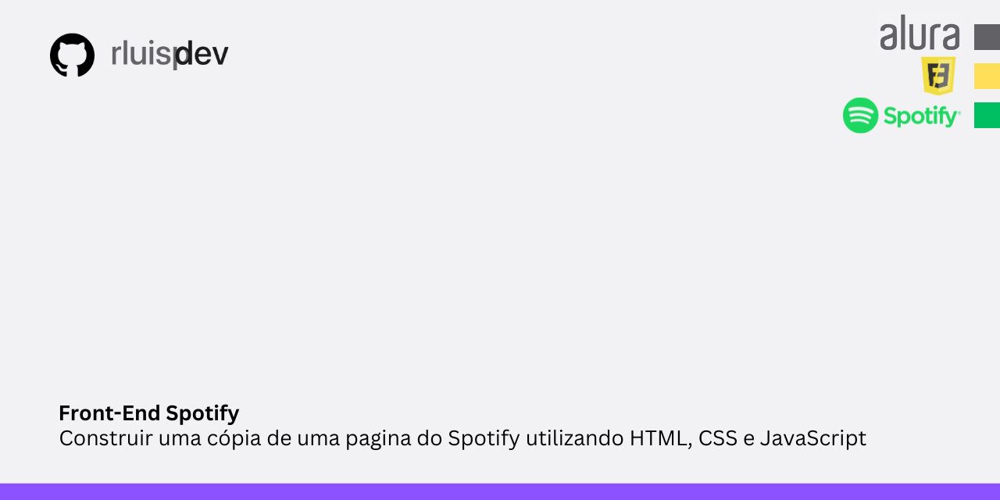

 
# Imersão Front-End 2ª Edição - Alura 

Aprender a construir uma pagina do Spotify utilizando HTML, CSS e JavaScript.

## 📚 Conteúdo do Curso

- **Aula1**: Revisão - HTML e CSS.
- **Aula2**: Estilo Avançado e posicionamento.
- **Aula3**:  Layout Flexbox, Pseudo-classes e Responsividade em CSS.
- **Aula4**:  🔄
- **Aula5**:  🔄
 
## 🛠️ Ferramentas e Tecnologias Utilizadas

- **Linguagem de Programação**: JavaScript
- **Ambiente de Desenvolvimento**: VSCODE
- **Controle de Versão**: Git

## 💻 Como Utilizar Este Repositório

1. Clone este repositório:
````
git@github.com:rluispdev/ImersaoAluraSpotify25rluispdev.git
````

 
## Instrutores
 
- Fernanda Degolin - Desenvolvedora Front-end na Globo.
- Mayara Cardoso Desenvolvedora Front-end no Itaú.

## Apresentação

- Guilherme Lima - Tech Educator e Professor na Alura e na USP


## 👨‍💻 Student
<p>
    
    <p>&nbsp&nbsp&nbsprluispdev<br>
    &nbsp&nbsp&nbsp
    <a href="https://github.com/rluispdev">
    GitHub</a>&nbsp;|&nbsp;
     <a href="https://cursos.alura.com.br/user/rluisp"> Alura Profile</a>
&nbsp;|&nbsp;
       <a href="https://www.dio.me/users/rluispdev">DIO</a>
&nbsp;|&nbsp;      
    <a href="https://www.linkedin.com/in/rafael-luis-gonzaga-b11634186/">LinkedIn</a>
&nbsp;|&nbsp;
    <a href="https://www.instagram.com/rluispdevs?igsh=cnoxenpmaHY1amE0&utm_source=qr">
    Instagram</a>
&nbsp;|&nbsp;</p>
</p>
<br/><br/>
<p>
